# Use Case Diagram - E-Commerce D'florist

## Diagram PlantUML

```plantuml
@startuml
left to right direction
skinparam packageStyle rectangle

actor Customer as C
actor Admin as A
actor "Payment Gateway" as PG
actor "Email System" as ES

rectangle "E-Commerce D'florist System" {
  
  ' Customer Use Cases
  package "Authentication" {
    usecase (Register) as UC1
    usecase (Login) as UC2
    usecase (Logout) as UC3
    usecase (Forgot Password) as UC4
    usecase (Verify OTP) as UC5
    usecase (Reset Password) as UC6
  }
  
  package "Product Management" {
    usecase (Browse Products) as UC7
    usecase (Search Products) as UC8
    usecase (View Product Detail) as UC9
    usecase (Filter by Category) as UC10
    usecase (View Promo Products) as UC11
  }
  
  package "Shopping Cart" {
    usecase (Add to Cart) as UC12
    usecase (Update Cart Quantity) as UC13
    usecase (Remove from Cart) as UC14
    usecase (View Cart) as UC15
    usecase (Clear Cart) as UC16
  }
  
  package "Address Management" {
    usecase (Add Address) as UC17
    usecase (Edit Address) as UC18
    usecase (Delete Address) as UC19
    usecase (Set Primary Address) as UC20
    usecase (Search Location on Map) as UC21
  }
  
  package "Order Management" {
    usecase (Checkout) as UC22
    usecase (Select Delivery Method) as UC23
    usecase (Calculate Shipping Cost) as UC24
    usecase (Select Delivery Schedule) as UC25
    usecase (Choose Payment Method) as UC26
    usecase (Place Order) as UC27
    usecase (View Order History) as UC28
    usecase (View Order Detail) as UC29
    usecase (Track Order Status) as UC30
    usecase (Request Order Cancellation) as UC31
    usecase (Upload Payment Proof) as UC32
    usecase (Download E-Receipt) as UC33
  }
  
  package "Review & Rating" {
    usecase (Write Review) as UC34
    usecase (Rate Product) as UC35
    usecase (View Reviews) as UC36
  }
  
  package "Customer Service" {
    usecase (Chat with CS) as UC37
    usecase (Send Message) as UC38
    usecase (View Chat History) as UC39
  }
  
  package "Profile Management" {
    usecase (View Profile) as UC40
    usecase (Edit Profile) as UC41
  }
  
  ' Admin Use Cases
  package "Admin - Product Management" {
    usecase (Manage Products) as UC42
    usecase (Add Product) as UC43
    usecase (Edit Product) as UC44
    usecase (Delete Product) as UC45
    usecase (Set Product Weight) as UC46
    usecase (Toggle Product Status) as UC47
    usecase (Set Promo Price) as UC48
  }
  
  package "Admin - Order Management" {
    usecase (View All Orders) as UC49
    usecase (Update Order Status) as UC50
    usecase (View Order Details) as UC51
    usecase (Handle Cancellation Request) as UC52
    usecase (Approve/Reject Cancellation) as UC53
    usecase (Export Order Report) as UC54
  }
  
  package "Admin - Customer Management" {
    usecase (View Customers) as UC55
    usecase (View Customer Detail) as UC56
    usecase (View Customer Orders) as UC57
  }
  
  package "Admin - Outlet Management" {
    usecase (Manage Outlets) as UC58
    usecase (Add Outlet) as UC59
    usecase (Edit Outlet) as UC60
    usecase (Delete Outlet) as UC61
    usecase (Toggle Outlet Status) as UC62
  }
  
  package "Admin - Settings" {
    usecase (Configure Shipping Costs) as UC63
    usecase (Set Delivery Radius) as UC64
    usecase (Manage Time Slots) as UC65
    usecase (Set Pre-order Days) as UC66
    usecase (Configure Quota) as UC67
  }
  
  package "Admin - Chat Management" {
    usecase (View All Chats) as UC68
    usecase (Reply to Customer) as UC69
    usecase (Close Conversation) as UC70
  }
  
  package "Admin - Reports" {
    usecase (View Dashboard) as UC71
    usecase (Generate Sales Report) as UC72
    usecase (View Statistics) as UC73
  }
}

' Customer Relationships
C --> UC1
C --> UC2
C --> UC3
C --> UC4
C --> UC7
C --> UC8
C --> UC9
C --> UC10
C --> UC11
C --> UC12
C --> UC13
C --> UC14
C --> UC15
C --> UC16
C --> UC17
C --> UC18
C --> UC19
C --> UC20
C --> UC21
C --> UC22
C --> UC27
C --> UC28
C --> UC29
C --> UC30
C --> UC31
C --> UC32
C --> UC33
C --> UC34
C --> UC35
C --> UC36
C --> UC37
C --> UC38
C --> UC39
C --> UC40
C --> UC41

' Admin Relationships
A --> UC2
A --> UC3
A --> UC4
A --> UC42
A --> UC43
A --> UC44
A --> UC45
A --> UC46
A --> UC47
A --> UC48
A --> UC49
A --> UC50
A --> UC51
A --> UC52
A --> UC53
A --> UC54
A --> UC55
A --> UC56
A --> UC57
A --> UC58
A --> UC59
A --> UC60
A --> UC61
A --> UC62
A --> UC63
A --> UC64
A --> UC65
A --> UC66
A --> UC67
A --> UC68
A --> UC69
A --> UC70
A --> UC71
A --> UC72
A --> UC73

' Include Relationships
UC4 ..> UC5 : <<include>>
UC5 ..> UC6 : <<include>>
UC22 ..> UC23 : <<include>>
UC22 ..> UC24 : <<include>>
UC22 ..> UC25 : <<include>>
UC22 ..> UC26 : <<include>>
UC27 ..> UC24 : <<include>>
UC37 ..> UC38 : <<include>>
UC42 ..> UC43 : <<include>>
UC42 ..> UC44 : <<include>>
UC42 ..> UC45 : <<include>>
UC58 ..> UC59 : <<include>>
UC58 ..> UC60 : <<include>>
UC58 ..> UC61 : <<include>>

' Extend Relationships
UC17 ..> UC21 : <<extend>>
UC18 ..> UC21 : <<extend>>
UC29 ..> UC31 : <<extend>>
UC29 ..> UC32 : <<extend>>
UC29 ..> UC33 : <<extend>>

' External System Relationships
UC27 --> PG : process payment
UC32 --> PG : verify payment
UC4 --> ES : send OTP
UC27 --> ES : send confirmation

@enduml
```

## Deskripsi Use Case

### Actor

1. **Customer (Pelanggan)**
   - User yang melakukan pembelian produk
   - Dapat melakukan registrasi, login, browsing produk, checkout, dll

2. **Admin**
   - Pengelola sistem
   - Mengelola produk, pesanan, customer, outlet, dan pengaturan sistem

3. **Payment Gateway**
   - Sistem eksternal untuk memproses pembayaran
   - Verifikasi bukti pembayaran

4. **Email System**
   - Sistem eksternal untuk mengirim email
   - OTP, konfirmasi pesanan, notifikasi

### Use Case Utama

#### Customer
1. **Authentication**: Register, Login, Logout, Forgot Password dengan OTP
2. **Product Browsing**: Lihat produk, cari, filter kategori, lihat promo
3. **Shopping Cart**: Tambah, update, hapus item di keranjang
4. **Address Management**: Kelola alamat pengiriman dengan map integration
5. **Order Management**: Checkout, pilih metode pengiriman, jadwal, pembayaran
6. **Order Tracking**: Lihat history, detail, status pesanan
7. **Order Cancellation**: Request pembatalan pesanan
8. **Review & Rating**: Beri review dan rating produk
9. **Customer Service**: Chat dengan CS
10. **Profile**: Kelola profil pribadi

#### Admin
1. **Product Management**: CRUD produk, set berat, promo, status
2. **Order Management**: Kelola pesanan, update status, handle cancellation
3. **Customer Management**: Lihat data customer dan riwayat pesanan
4. **Outlet Management**: CRUD outlet untuk perhitungan jarak
5. **Settings**: Atur ongkir, radius, time slots, quota
6. **Chat Management**: Balas chat customer
7. **Reports**: Dashboard, laporan penjualan, statistik

### Fitur Khusus

1. **Dynamic Shipping Cost**
   - Berdasarkan berat produk (per kg, pembulatan ke atas)
   - Tier jarak: 0-200km, 201-400km, 401-600km, >600km
   - Kurir toko (flat), Ekspedisi (dinamis), Pick up (gratis)

2. **Pre-order System**
   - Minimal H+2 dari hari ini
   - Pilih tanggal dan slot waktu pengiriman
   - Kuota maksimal per tanggal

3. **Multi-outlet System**
   - Sistem otomatis cari outlet terdekat
   - Perhitungan jarak untuk ongkir
   - Metode pengiriman disesuaikan dengan jarak

4. **OTP Email Verification**
   - Forgot password menggunakan OTP via email
   - Countdown timer 10 menit
   - Untuk admin dan customer

5. **Order Cancellation**
   - Customer request pembatalan
   - Admin approve/reject
   - Status tracking

## Relationship Types

- **Association (→)**: Actor menggunakan use case
- **Include (..>)**: Use case wajib memanggil use case lain
- **Extend (..>)**: Use case opsional dipanggil dalam kondisi tertentu

## Notes

- Sistem menggunakan PHP dengan MySQL database
- Frontend: Bootstrap 5, Leaflet Maps
- Email: PHPMailer dengan SMTP
- Payment: Manual upload bukti transfer
- Chat: Real-time dengan AJAX polling
